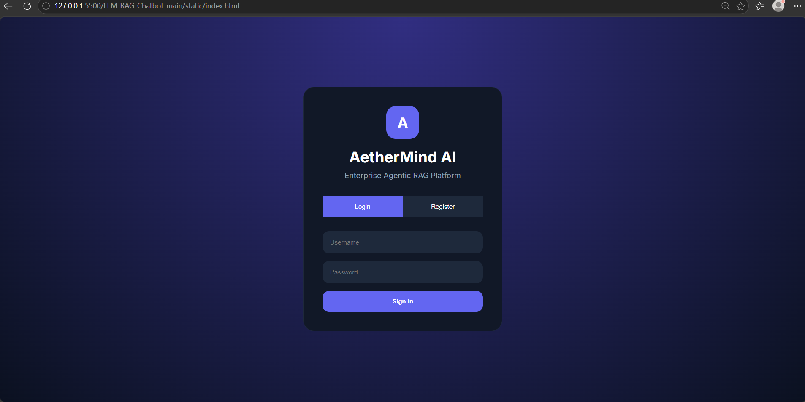

# 🚀 AetherMind AI — Enterprise LLM-Powered RAG Chatbot

An enterprise-grade **Retrieval-Augmented Generation (RAG)** AI platform that enables users to interact with private documents and web knowledge through a modern conversational AI workspace.

Built using **FastAPI, LangChain, ChromaDB, Groq LLaMA-3, sentence-transformers, Streamlit, and a custom HTML/CSS/JavaScript frontend**, the platform supports semantic document retrieval, multi-document ingestion, conversational memory, and grounded AI responses.

The project provides:
- A production-style enterprise AI workspace UI
- A Streamlit-based AI demo interface
- A FastAPI REST backend with Swagger documentation
- A modular conversational RAG pipeline

Designed to simulate real-world enterprise AI assistants and modern GenAI knowledge systems.
> Designed as a portfolio : small, well-structured, easy to
> demo, and uses only free tools out-of-the-box.

---

## ✨ Features

### 🤖 Conversational AI & RAG
- Conversational multi-turn RAG pipeline
- History-aware question rewriting
- Context-grounded AI responses
- Semantic similarity retrieval
- Citation-aware answer generation
- Anti-hallucination guardrails
- Conversational memory support

---

### 🧠 LLM & Embeddings
- Pluggable LLM providers:
  - Groq (fast & free)
  - OpenAI
  - Ollama (fully local)
- Local embeddings using:
  `sentence-transformers/all-MiniLM-L6-v2`
- No embeddings API key required

---

### 📂 Document & URL Ingestion
Supports:
- PDF
- DOCX
- TXT
- Markdown
- ZIP
- Web URLs

Features:
- Multi-document ingestion
- Persistent vector storage
- ChromaDB-powered semantic search
- Intelligent text chunking

---

### 💻 Enterprise AI Workspace UI
#### Custom Frontend (HTML/CSS/JavaScript)
- ChatGPT-style sidebar
- Recent chat history
- Chat search functionality
- Session-based conversations
- Modern dark theme dashboard
- File upload & ingestion workspace
- Interactive AI assistant interface
- Markdown rendering
- Syntax-highlighted code blocks

#### Streamlit AI Demo UI
- Rapid AI prototyping interface
- Lightweight testing environment
- Quick deployment support

---

### 🔐 Authentication & Security
- JWT-based authentication
- Username or email login support
- Password hashing using bcrypt
- OTP-based password reset workflow
- Protected API routes
- Secure session handling
- User registration & login system

---

### ⚡ Backend & APIs
- FastAPI REST backend
- Auto-generated Swagger documentation (`/docs`)
- Reusable modular RAG architecture
- CLI support (`python cli.py chat`)
- Fully type-hinted codebase

---

### 🧪 Testing & Reliability
- Unit & integration tests using `pytest`
- Modular, production-style architecture
- Persistent ChromaDB vector database
- Scalable ingestion pipeline
## 🏗️ Architecture

```text
                        ┌──────────────────────────┐
                        │   Custom Frontend UI     │
                        │ (HTML / CSS / JavaScript)│
                        └────────────┬─────────────┘
                                     │
                        ┌────────────▼─────────────┐
                        │      Streamlit UI        │
                        │   (AI Demo Interface)    │
                        └────────────┬─────────────┘
                                     │
                                     ▼
                    ┌────────────────────────────────┐
                    │        FastAPI Backend         │
                    │  REST APIs + JWT Authentication│
                    └───────────────┬────────────────┘
                                    │
                                    ▼
                    ┌────────────────────────────────┐
                    │     Conversational RAG Chain   │
                    │  • Question Rewriting          │
                    │  • Context Orchestration       │
                    │  • Conversational Memory       │
                    └───────────────┬────────────────┘
                                    │
         ┌──────────────────────────┴──────────────────────────┐
         │                                                     │
         ▼                                                     ▼

┌──────────────────────┐                        ┌──────────────────────┐
│   Document Loaders   │                        │    User Questions    │
│ PDF · DOCX · TXT     │                        │  Conversational Chat │
│ Markdown · URLs      │                        └──────────┬───────────┘
└──────────┬───────────┘                                   │
           ▼                                               │

┌──────────────────────┐                                   │
│ Recursive Text Split │                                   │
│ Intelligent Chunking │                                   │
└──────────┬───────────┘                                   │
           ▼                                               │

┌──────────────────────┐                                   │
│ Sentence Transformers│                                   │
│ Embedding Generation │                                   │
└──────────┬───────────┘                                   │
           ▼                                               │

┌──────────────────────┐◀──────────────────────────────────┘
│      ChromaDB        │
│ Persistent Vector DB │
└──────────┬───────────┘
           │
           ▼

┌──────────────────────────────────────┐
│ Retriever + Semantic Similarity Search│
│        Top-K Context Retrieval        │
└──────────┬────────────────────────────┘
           ▼

┌──────────────────────────────────────┐
│      Prompt Engineering Layer        │
│ • Context Grounding                  │
│ • Citation-aware Responses           │
│ • Anti-hallucination Guardrails      │
└──────────┬───────────────────────────┘
           ▼

┌──────────────────────────────────────┐
│         LLM Inference Layer          │
│   Groq · OpenAI · Ollama · LLaMA-3   │
└──────────┬───────────────────────────┘
           ▼

┌──────────────────────────────────────┐
│   Grounded AI Response + Sources     │
└──────────────────────────────────────┘
```

---
## 🛠️ Tech Stack

| Layer                   | Technologies                             |
|---                      |---                                       |
| **Frontend UI**         | HTML · CSS · JavaScript                  |
| **AI Demo Interface**   | Streamlit                                |
| **Backend Framework**   | FastAPI · Uvicorn                        |
| **Authentication**      | JWT Authentication                       |
| **RAG Orchestration**   | LangChain (LCEL)                         |
| **LLM Providers**       | Groq · OpenAI · Ollama · LLaMA-3         |
| **Embeddings**          | `sentence-transformers/all-MiniLM-L6-v2` |
| **Vector Database**     | ChromaDB (persistent vector storage)     |
| **Document Processing** | pypdf · python-docx · BeautifulSoup4     |
| **Semantic Retrieval**  | Chroma Retriever · Similarity Search     |
| **Prompt Engineering**  | Context-grounded prompt templates        |
| **Configuration**       | Pydantic Settings · `.env`               |
| **Testing**             | pytest · FastAPI TestClient              |
| **API Documentation**   | Swagger UI · ReDoc                       |
| **Storage**             | Chroma Persistent Storage · SQLite       |
| **Deployment Ready**    | Docker-ready architecture                |


## 🚀 Quick Start

### 1️⃣ Clone & Install

```bash
git clone https://github.com/ac0628334/LLM-Powered-RAG-Chatbot.git

cd LLM-Powered-RAG-Chatbot

python -m venv .venv

# Windows
.venv\Scripts\activate

# Linux/macOS
source .venv/bin/activate

pip install -r requirements.txt
```

---

## ⚙️ Environment Setup

Create a `.env` file:

### Groq (Recommended)

```env
LLM_PROVIDER=groq
GROQ_API_KEY=gsk_xxxxxxxxx
```

### OpenAI

```env
LLM_PROVIDER=openai
OPENAI_API_KEY=sk-xxxxxxxxx
```

### Ollama (Local)

```bash
ollama pull llama3.2
```

```env
LLM_PROVIDER=ollama
OLLAMA_MODEL=llama3.2
```

---

## ▶️ Run the Project

### FastAPI Backend

```bash
uvicorn api.main:app --reload --port 8000
```

Backend:
```text
http://localhost:8000
```

API Docs:
- `/docs`
- `/redoc`

## 📸 Screenshots 


---

### Custom Frontend UI

Open:

```text
static/index.html
```

or run using VS Code Live Server.

## 📸 Screenshots

### 🔹 Login Interface



---

### 🔹 Enterprise AI Workspace


---

### Streamlit AI Demo

```bash
streamlit run app.py
```

Streamlit:
```text
http://localhost:8501
---
  
## ⚡ Redis Caching

Redis is integrated for response caching and performance optimization.

The Redis service runs inside a Docker container during local development.

### Run Redis Container

```bash
docker run -d --name redis -p 6379:6379 redis
```

# 🧪 Example Workflow

1. Register/Login
2. Upload PDF/DOCX/TXT documents
3. Ingest URLs
4. Ask questions in chat
5. Retrieve grounded AI responses with citations

# 🔌 API Endpoints

## REST API

| Method   | Endpoint         | Description                                                            |
|---       |---               |---                                                                     |
| `GET`    | `/health`        | Backend health check / liveness probe                                  |
| `GET`    | `/status`        | Returns vector count, embedding model, provider, and RAG configuration |
| `POST`   | `/register`      | User registration                                                      |
| `POST`   | `/login`         | JWT-based user authentication                                          |
| `POST`   | `/ingest/files`  | Upload and ingest PDF, DOCX, TXT, Markdown, CSV, or ZIP files          |
| `POST`   | `/ingest/urls`   | Ingest web URLs into the vector database                               |
| `POST`   | `/chat`          | Conversational AI chat endpoint                                        |
| `GET`    | `/history`       | Retrieve user chat history                                             |
| `DELETE` | `/collection`    | Reset / wipe the vector database collection                            |
| `POST`   | `/send-otp`      | Generate OTP for password reset                                        |
| `POST`   | `/reset-password`| Reset password using OTP                                               |

---
## 🔌 API Usage

### Example Requests

```bash
# Health Check
curl http://localhost:8000/health

# Upload Documents
curl -X POST http://localhost:8000/ingest/files \
-F "files=@./data/handbook.pdf"

# Ingest URLs
curl -X POST http://localhost:8000/ingest/urls \
-H "Content-Type: application/json" \
-d '{"urls":["https://example.com"]}'

# Chat Request
curl -X POST http://localhost:8000/chat \
-H "Content-Type: application/json" \
-d '{"question":"What is RAG?","history":[]}'
```

---

## ⚡ Multi-Frontend Support

| Interface               | Technology              |
|---                      |---                      |
| Enterprise AI Workspace | HTML · CSS · JavaScript |
| AI Demo Interface       | Streamlit               |

Both frontends connect to the same:
- FastAPI backend
- LangChain RAG pipeline
- ChromaDB vector store

| Service         | Port   |
|---              |---     |
| FastAPI Backend | `8000` |
| Streamlit UI    | `8501` |

---

## 🖥️ CLI Commands

```bash
# Ingest documents
python cli.py ingest --path ./data

# Ingest URLs
python cli.py ingest --url https://example.com

# Interactive chat
python cli.py chat

# Vector DB status
python cli.py status

# Reset vector DB
python cli.py reset
```

---

# 📂 Project Structure

```text
LLM-Powered-RAG-Chatbot/
│
├── api/                            # FastAPI backend APIs
│   ├── __init__.py
│   ├── auth.py                     # Authentication routes
│   ├── chatbot.py                  # Chat APIs
│   ├── init_db.py                  # Database initialization
│   └── main.py                     # Main FastAPI app
│
├── src/                            # Core RAG logic
│   ├── __init__.py
│   ├── auth.py                     # JWT authentication logic
│   ├── config.py                   # Environment configuration
│   ├── database.py                 # Database connection
│   ├── document_loader.py          # PDF/DOCX/TXT/URL loaders
│   ├── embeddings.py               # Sentence transformer embeddings
│   ├── ingest.py                   # File & URL ingestion pipeline
│   ├── llm.py                      # Groq/OpenAI/Ollama LLM setup
│   ├── models.py                   # Database models
│   ├── prompts.py                  # Prompt templates
│   ├── rag_chain.py                # Conversational RAG pipeline
│   ├── schemas.py                  # Pydantic schemas
│   ├── text_splitter.py            # Recursive text splitting
│   └── vector_store.py             # ChromaDB vector store
│
├── static/                         # Custom frontend UI
│   ├── index.html
│   ├── style.css
│   └── app.js
│
├── tests/                          # Unit & integration tests
│   ├── __init__.py
│   ├── test_api.py
│   ├── test_config.py
│   ├── test_document_loader.py
│   └── test_text_splitter.py
│
├── data/                           # Uploaded documents
│
├── chroma_db/                      # Persistent vector database
│
├── chat_db/                        # Chat/session database
│
├── app.py                          # Streamlit UI
├── cli.py                          # CLI interface
├── worker.py                       # Background worker
├── requirements.txt
├── README.md
├── .env
├── .gitignore
│
└── chroma.sqlite3                  # Chroma metadata database
```
---
## How it works

1. **Document ingestion.** Files and URLs are loaded into LangChain `Document` objects, split into overlapping chunks, embedded using sentence-transformers, and stored in ChromaDB.

2. **History-aware retrieval.** Follow-up questions are rewritten into standalone questions using previous chat history before retrieval.

3. **Semantic search.** The system retrieves the most relevant document chunks from ChromaDB using vector similarity search.

4. **Grounded AI generation.** Retrieved context is injected into a strict prompt that instructs the LLM to answer only from the provided documents and cite sources.

5. **Source attribution.** Retrieved sources, metadata, and page references are returned alongside the generated answer and displayed in the UI.

---

## Running the tests

```bash
pytest -q
```

The tests cover the splitter, document loaders, and configuration. (LLM and
vector-store integration tests are intentionally omitted to keep the suite
hermetic and fast.)

---

## Tuning

All hyperparameters live in `.env`:

| Variable        | Default | Purpose                                  |
| --------------- | ------- | ---------------------------------------- |
| `CHUNK_SIZE`    | 1000    | Characters per chunk                     |
| `CHUNK_OVERLAP` | 200     | Overlap between adjacent chunks          |
| `TOP_K`         | 4       | Chunks retrieved per query               |
| `TEMPERATURE`   | 0.2     | LLM sampling temperature                 |
| `MAX_TOKENS`    | 1024    | Maximum tokens in the generated answer   |

---

# 🚀 Roadmap / Future Enhancements

## 🔹 AI & Retrieval Improvements
- [ ] Hybrid Retrieval (BM25 + Dense Vector Search)
- [ ] Cross-Encoder Re-ranking
- [ ] Context Compression & Smart Chunking
- [ ] Query Expansion & Multi-Query Retrieval
- [ ] Advanced Prompt Optimization
- [ ] Evaluation Framework using Ragas

---

## 🔹 Conversational AI Enhancements
- [ ] Streaming AI Responses
- [ ] Real-Time Typing Indicators
- [ ] Long-Term Conversational Memory
- [ ] Multi-Agent AI Workflows
- [ ] LangGraph Integration
- [ ] Voice-Based AI Assistant

---

## 🔹 Enterprise Features
- [ ] Multi-Tenant User Collections
- [ ] Role-Based Access Control (RBAC)
- [ ] Admin Dashboard & Analytics
- [ ] User Activity Monitoring
- [ ] Enterprise Document Permissions
- [ ] Audit Logging

---

## 🔹 Infrastructure & Scalability
- [ ] Docker & Docker Compose Deployment
- [ ] Kubernetes Scaling
- [ ] Redis Response Caching
- [ ] Celery Background Workers
- [ ] Async File Processing
- [ ] Load Balancing & API Scaling

---

## 🔹 Document Intelligence
- [ ] OCR Support for Scanned PDFs
- [ ] Image-Based Document Understanding
- [ ] Table Extraction & Analysis
- [ ] Multi-Modal AI Support
- [ ] Video & Audio Transcript Ingestion

---

## 🔹 Frontend & User Experience
- [ ] Drag-and-Drop File Uploads
- [ ] Chat Export & Sharing
- [ ] Mobile Responsive Workspace
- [ ] Advanced Search Filters
- [ ] Dark / Light Theme Toggle
- [ ] Real-Time Notifications
---


# 👨‍💻 Author

## Abhishek Mohan Chavan

- AI & ML Enthusiast
- Generative AI Developer
- RAG Systems Developer
- Full Stack AI Engineer

GitHub:
https://github.com/ac0628334


## 📄 License

This project is licensed under the MIT License.